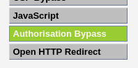
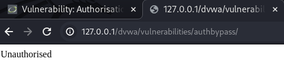
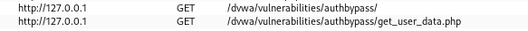
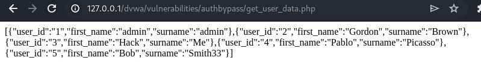
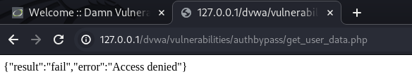
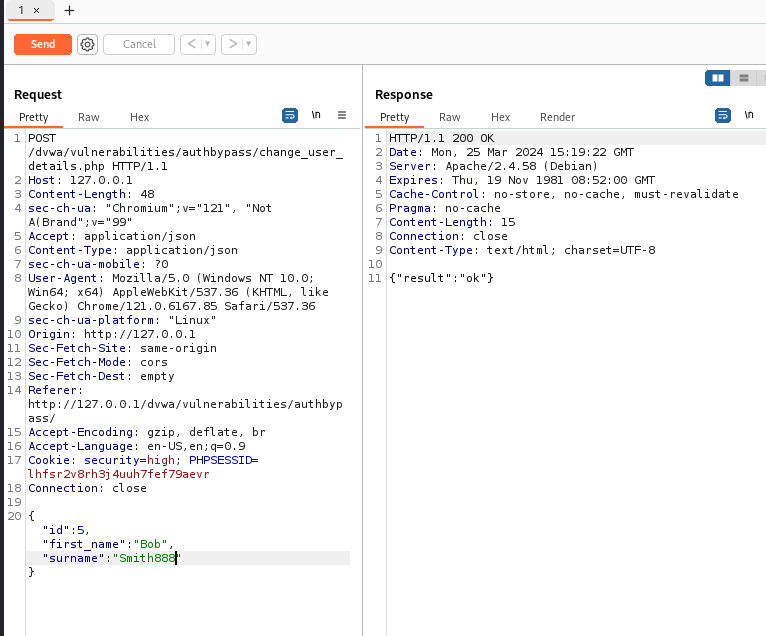

# Authorisation Bypass

此頁面只能由管理員使用者存取。 
您面臨的挑戰是使用其他使用者之一（例如 gordonb / abc123）來存取這些功能。

所以如果你dvwa登入gordonb / abc123，會看不到這個頁面

gordonb 

admin



## Low 
完全沒有做任何控管，因此就算不是最高權限使用者登入
只要知道URL，仍可以訪問到頁面

    dvwa/vulnerabilities/authbypass/

可以使用dirb來找到這個路徑

存取控制漏洞：IDOR

https://www.ecloudvalley.com/tw/blog/idor-has-now-become-common-flaw-in-api-design

https://portswigger.net/web-security/access-control/idor


## Medium

The developer has locked down access to the HTML for the page, but have a look how the page is populated when logged in as the admin.

這個難度如果直接URL訪問，會得到Unauthorised 字樣



從Burpsuite HTTP history 中可以看到
在真正admin存取時，可以看到總共訪問了兩個東西


訪問之下才發現，api json 它根本沒有擋!!



## HIGH
Both the HTML page and the API to retrieve data have been locked down, but what about updating data? You have to make sure you test every call to the site.

HIGH版本總算連json也擋掉了
既然GET沒辦法，何不嘗試看看POST?



POST 的URL 為
```
dvwa/vulnerabilities/authbypass/change_user_details.php
```
我們可以自己撰寫一隻javascript

```javascript
fetch('http://127.0.0.1/dvwa/vulnerabilities/authbypass/change_user_details.php', { method: 'POST', 
        headers: { 'Accept': 'application/json', 'Content-Type': 'application/json'},
        body: JSON.stringify({ 'id':1, "first_name": "Harry", "surname": "Hacker" })
        }) .then((response) => response.json()).then((data) => console.log(data));
```

發現就算不是admin，也能用post去改動資料

