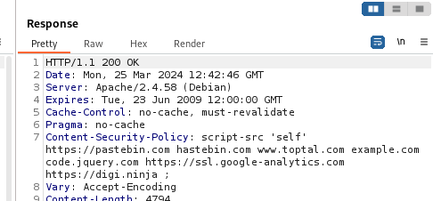
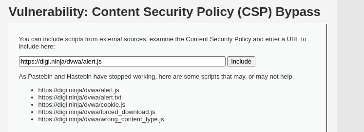
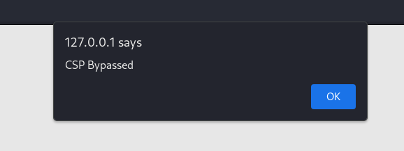
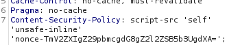
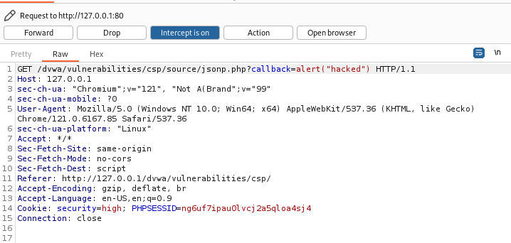

# CSP bypass

CSP 是 Content Security Policy（內容安全策略）的縮寫，它是一種在網頁應用程式中幫助防止跨站腳本攻擊 (XSS) 和其他類型攻擊的安全機制。
CSP 可以指定諸如以下內容：

* 允許載入資源的來源（包括 JavaScript、CSS、圖片、字體等）
* 禁止內嵌 JavaScript
* 禁止內嵌 CSS
* 禁止使用不安全的 eval() 函數
* 禁止載入未使用 HTTPS 協議的資源
* 禁止使用內聯事件處理程序等

## Low

從burpsuite 來看CSP，可以看到CSP與允許的網域：



```
   Content-Security-Policy: script-src 'self' https://pastebin.com hastebin.com www.toptal.com example.com code.jquery.com https://ssl.google-analytics.com https://digi.ninja ;
```

Low 要描述的是，CSP中允許的網站會整個include，因此可以對include 的JS做手腳
繞過CSP





## Mdeium

開發者想要使用nonce來防止CSP內嵌腳本
使用BurpSuite 看nonce 



解法很簡單，只要script附贈nonce的值，就可以繞過CSP Pass
```
    <script nonce="TmV2ZXIgZ29pbmcgdG8gZ2l2ZSB5b3UgdXA=">alert(1)</script>
```

## HIGH
開發者對source進行JSONP調用/jsonp.php文件傳遞要return 的函數名
去修改json.php文件來運行自己的程式碼

一樣去看程式源碼
```javascript
    function clickButton() {
        var s = document.createElement("script");
        s.src = "source/jsonp.php?callback=solveSum";
        document.body.appendChild(s);
    }

    function solveSum(obj) {
	    if ("answer" in obj) {
		    document.getElementById("answer").innerHTML = obj['answer'];
	    }
    }

    var solve_button = document.getElementById ("solve");

    if (solve_button) {
	    solve_button.addEventListener("click", function() {
		    clickButton();
	    });
    }
```

可以看到程式碼會去appendChild，把jsonp.php呼叫進來
我們只需要把callback的指令改成alert即可成功




