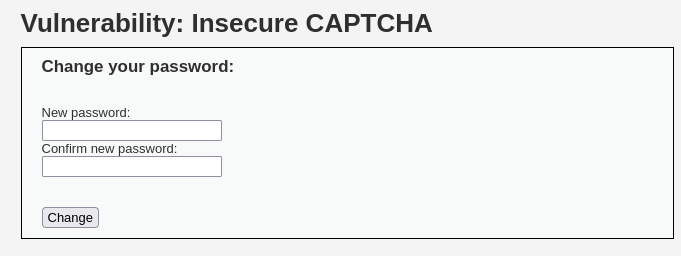
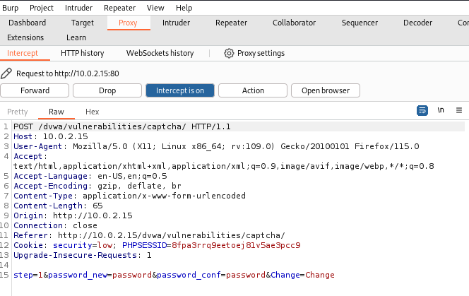
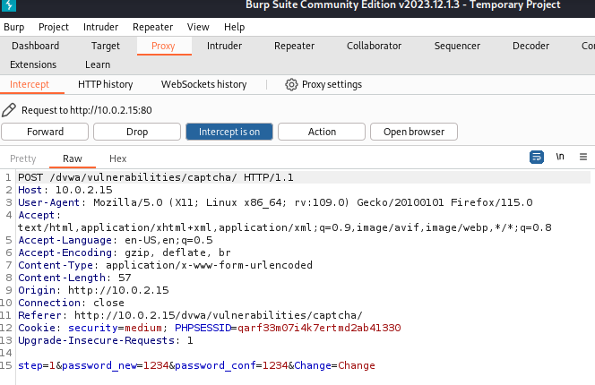
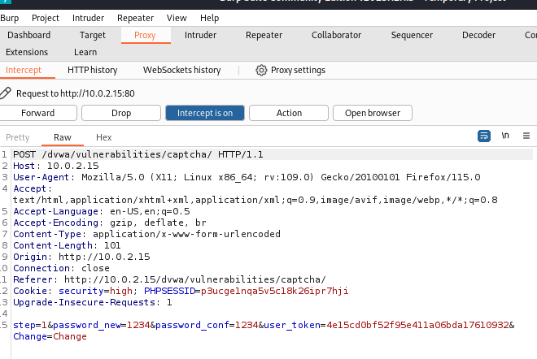

## Insecure CAPCHA

CAPCHA 是一個程式，它可以判斷訪問網頁的用戶是人還是機器人，CAPTCHA通常用於保護敏感功能免受自動機器人攻擊，該功能通常在用戶註冊、密碼更改、發布內容中使用，這對使用CSRF攻擊和爆破攻擊提供了有限的保護


-- 看不到CAPTCHA沒關係，因為我們的目的是繞過它

### Low Level 

源碼：
```php

Unknown Vulnerability Source
vulnerabilities/captcha/source/low.php
<?php

if( isset( $_POST[ 'Change' ] ) && ( $_POST[ 'step' ] == '1' ) ) {
    // Hide the CAPTCHA form
    $hide_form = true;

    // Get input
    $pass_new  = $_POST[ 'password_new' ];
    $pass_conf = $_POST[ 'password_conf' ];

    // Check CAPTCHA from 3rd party
    $resp = recaptcha_check_answer(
        $_DVWA[ 'recaptcha_private_key'],
        $_POST['g-recaptcha-response']
    );

    // Did the CAPTCHA fail?
    if( !$resp ) {
        // What happens when the CAPTCHA was entered incorrectly
        $html     .= "<pre><br />The CAPTCHA was incorrect. Please try again.</pre>";
        $hide_form = false;
        return;
    }
    else {
        // CAPTCHA was correct. Do both new passwords match?
        if( $pass_new == $pass_conf ) {
            // Show next stage for the user
            echo "
                <pre><br />You passed the CAPTCHA! Click the button to confirm your changes.<br /></pre>
                <form action=\"#\" method=\"POST\">
                    <input type=\"hidden\" name=\"step\" value=\"2\" />
                    <input type=\"hidden\" name=\"password_new\" value=\"{$pass_new}\" />
                    <input type=\"hidden\" name=\"password_conf\" value=\"{$pass_conf}\" />
                    <input type=\"submit\" name=\"Change\" value=\"Change\" />
                </form>";
        }
        else {
            // Both new passwords do not match.
            $html     .= "<pre>Both passwords must match.</pre>";
            $hide_form = false;
        }
    }
}

if( isset( $_POST[ 'Change' ] ) && ( $_POST[ 'step' ] == '2' ) ) {
    // Hide the CAPTCHA form
    $hide_form = true;

    // Get input
    $pass_new  = $_POST[ 'password_new' ];
    $pass_conf = $_POST[ 'password_conf' ];

    // Check to see if both password match
    if( $pass_new == $pass_conf ) {
        // They do!
        $pass_new = ((isset($GLOBALS["___mysqli_ston"]) && is_object($GLOBALS["___mysqli_ston"])) ? mysqli_real_escape_string($GLOBALS["___mysqli_ston"],  $pass_new ) : ((trigger_error("[MySQLConverterToo] Fix the mysql_escape_string() call! This code does not work.", E_USER_ERROR)) ? "" : ""));
        $pass_new = md5( $pass_new );

        // Update database
        $insert = "UPDATE `users` SET password = '$pass_new' WHERE user = '" . dvwaCurrentUser() . "';";
        $result = mysqli_query($GLOBALS["___mysqli_ston"],  $insert ) or die( '<pre>' . ((is_object($GLOBALS["___mysqli_ston"])) ? mysqli_error($GLOBALS["___mysqli_ston"]) : (($___mysqli_res = mysqli_connect_error()) ? $___mysqli_res : false)) . '</pre>' );

        // Feedback for the end user
        echo "<pre>Password Changed.</pre>";
    }
    else {
        // Issue with the passwords matching
        echo "<pre>Passwords did not match.</pre>";
        $hide_form = false;
    }

    ((is_null($___mysqli_res = mysqli_close($GLOBALS["___mysqli_ston"]))) ? false : $___mysqli_res);
}

?>


```

根據源碼的邏輯判斷，修改密碼被分成了兩個步驟
首先使用recaptcha_check_answer() 檢查用戶輸入驗證碼
驗證通過後Server 返回表單。
接著用戶提交POST修改密碼，這時發現Server只檢查Chane、step兩個參數來判斷用戶是否通過驗證
而step是我們可控的


使用BurpSuite 攔截後，把step改成2即可

### Medium Level 

改動：
step=2&password_new=password&password_conf=password&passed_captcha=true&Change=Change.”
開發人員在session 中設置狀態變量，追蹤用戶在提交之前是否成功完成驗證碼
因為狀態變量passed_captcha在用戶端，因此攻擊者可以對其進行操作

源碼被追加的判定
```php
    // Check to see if they did stage 1
    if( !$_POST[ 'passed_captcha' ] ) {
        $html     .= "<pre><br />You have not passed the CAPTCHA.</pre>";
        $hide_form = false;
        return;
    } 
```


攔截資訊將step = 2 、並添加passed_captcha = true 即可

### HIGH Level 

有些開發的廢棄code 被遺留在頁面中，可以模擬這些程式變量，允許將無效值注入驗證碼字段
你需要欺騙reCAPTCHA以及使用CAPCHA值(hidd3n_valu3)來越過檢查。

查看SourceCode 
發現驗證是 $resp(驗證碼結果) == false ，且g-recaptcha-response != hidd3m_valu3 或是http Headder 的 User-agent != reCAPCHA 時驗證錯誤

重點如下：

```php
<?php

if( isset( $_POST[ 'Change' ] ) ) { 
    ...
    $resp = recaptcha_check_answer($_DVWA[ 'recaptcha_private_key' ],$_POST['g-recaptcha-response']); 
    if ($resp || (
            $_POST[ 'g-recaptcha-response' ] == 'hidd3n_valu3'
            && $_SERVER[ 'HTTP_USER_AGENT' ] == 'reCAPTCHA'
        ))
    { 
        ...
    }
}
```


將User-Agent = reCAPTCHA 以及追加g-recaptcha-response=hidd3n_valu3