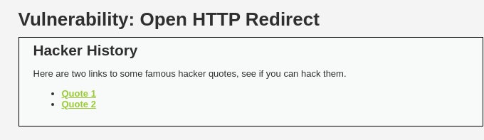
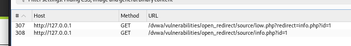
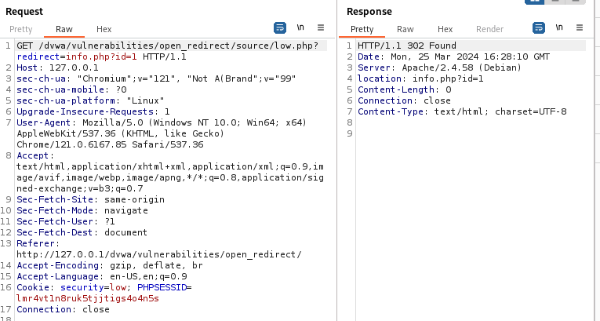
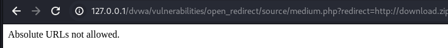
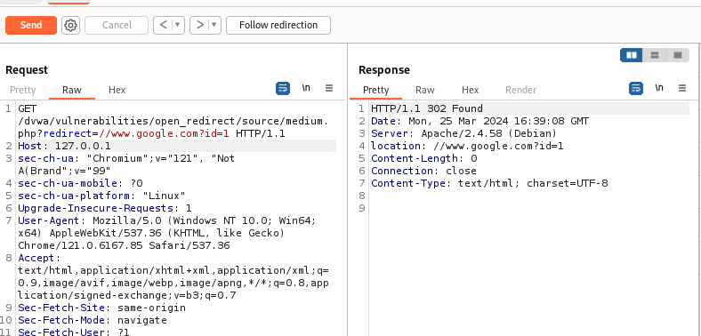
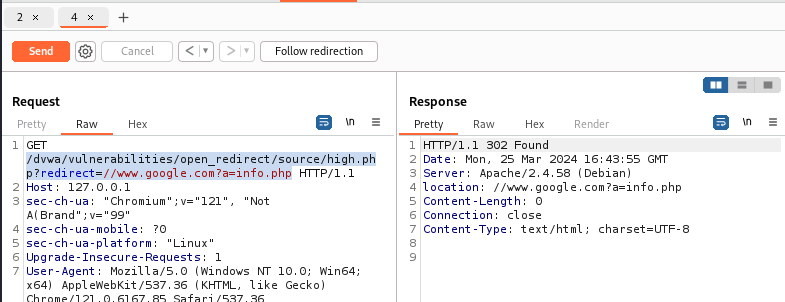

# Open HTTP Redirect

## Low 
The redirect page has no limitations, you can redirect to anywhere you want.

開發者的重定向沒有多加設計，讓人可以隨心所欲地到處亂跑



使用Burpsuite 攔截，可以看到兩個路徑

得知了它的redirect的地方

直接把url複製起來，就可以訪問到外面去了，redirect改成想要外連的網頁
```
    http://127.0.0.1/dvwa/vulnerabilities/open_redirect/source/low.php?redirect=http://download.zip?id=1
```

## Medium
在medium的session中，它把URL絕對路徑擋住了
```
    http://127.0.0.1/dvwa/vulnerabilities/open_redirect/source/medium.php?redirect=http://download.zip?id=1
```
回傳的結果：


但如果把http拿掉改成相對路徑，還是可以訪問的到
```
    http://127.0.0.1/dvwa/vulnerabilities/open_redirect/source/medium.php?redirect=//www.google.com?id=1
```



## HIGH
The redirect page tries to lock you to only redirect to the info.php page, but does this by checking that the URL contains "info.php".

這下使用相對路徑也被封了，但是這題有解釋它只會redirect to the info.php
因此你只需要小小改一下變數

```
    http://127.0.0.1/dvwa/vulnerabilities/open_redirect/source/high.php?redirect=//www.google.com?a=info.php
```


