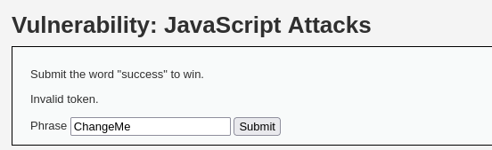
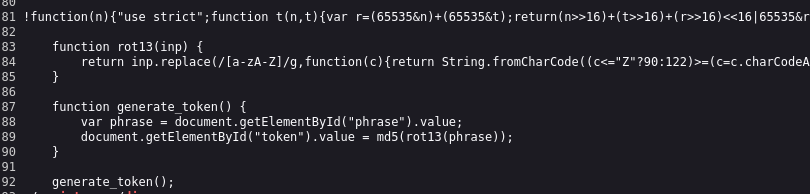
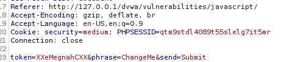
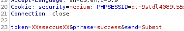
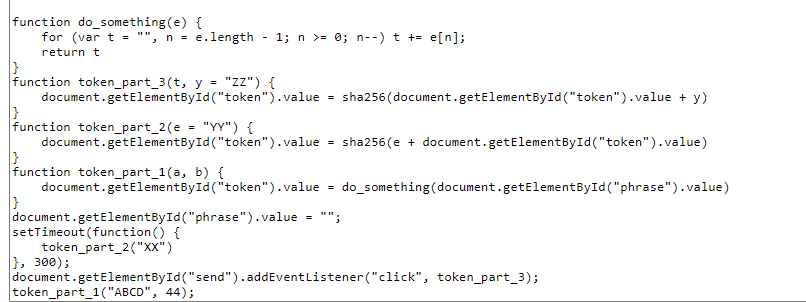
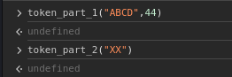
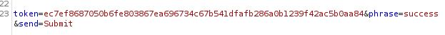

# Javascript Attack 

## Low


題目操作可以得知幾個訊息，只要輸入success就可成功
但如果在輸入框輸入success，只會得到Invalid token 的字樣
因此可以斷定後台的程式除了文字判定以外，還有token的判定

查看程式源碼，可以看到生成token以及md5的地方皆在前端：



生成token的方法是取值做md5
解法很簡單，輸入完success之後，送出前在console呼叫generate_token()，刷新token變數，即可攻擊成功。(目的是將token覆蓋掉)

## Medium

先進入F12，看到JS被放在
```html
<script src="../../vulnerabilities/javascript/source/medium.js"></script>
```
路徑中，找到前端程式碼
從Debugger 查看。
```javascript
    function do_something(e) {
        for (var t = '', n = e.length - 1; n >= 0; n--) t += e[n];
       return t
    }
    setTimeout(function () {
        do_elsesomething('XX')
    }, 300);
    function do_elsesomething(e) {
    document.getElementById('token').value = do_something(e + document.getElementById('phrase').value + 'XX')
    }
```
知道前端程式碼有一個do_something可以用，程式內容是讓t去加某些值

從Burpsuite 攔截資訊



可以發現token 是XXChangeMeXX的反轉 : XXeMgenahCXX
我們直接從token改寫下手，從程式碼可以看出token的值來源
執行
```
    do_something("XX")
```
讓它把token洗掉，輸出成功(或是其實直接改Burpsuite封包也能達到效果)



## HIGH

先看js 程式原始碼，程式源碼被混淆了不能閱讀
可以使用deobuscate 來解析

http://deobfuscatejavascript.com/

可以看到最下面的程式functino有幾項

程式中可以得知幾個訊息
第一個被執行的程式碼是token_part_1
第二個延遲300秒執行的則是token_part_2
token_part_3則是按鈕按下去時執行。

所以我們按照它的步驟依序執行part_1、par讓token符合規定，即可成功



