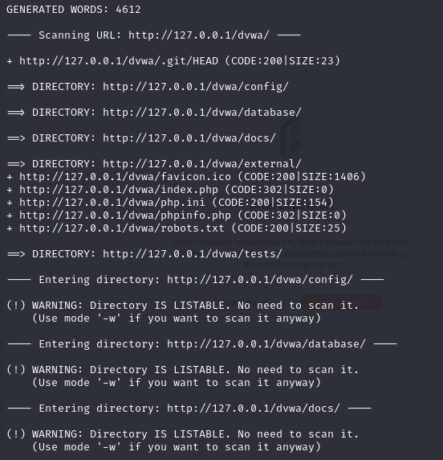
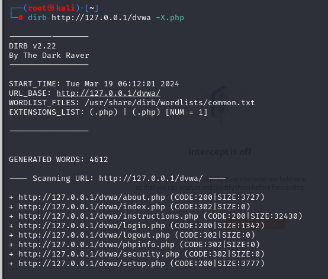

## Dirb 是什麼？

Dirb是一種用於在Web伺服器上進行目錄掃描的常用工具。它通常用於發現伺服器上隱藏的目錄或文件，以及嘗試找出潛在的敏感文件或目錄，例如未經授權的訪問或配置錯誤可能導致的漏洞。

Dirb（Directory Buster）的工作原理是嘗試使用給定的字典文件中的常見目錄和文件名，向目標伺服器發送HTTP請求，然後根據伺服器的回應來確定是否存在目標目錄或文件。如果伺服器返回一個有效的回應，那麼Dirb會將其列為發現的目錄或文件。
簡單說，就是對Web進行字典攻擊


## 使用方法

```
    dirb http://127.0.0.1/dvwa
```


* 指定特定查詢，使用-X表示，指定.php類別的資料
```
 dirb http://127.0.0.1/dvwa -X.php
```

